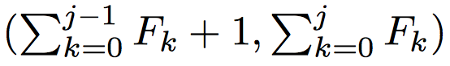

### A Multiagent Approach to Q-Learning for Daily Stock Trading [[link](https://trello-attachments.s3.amazonaws.com/589f14ffcc9e1569cd7332f1/589f59d488e48a1ab4f6cdfa/03accabf880509bb2cc06dfbc24d1ec6/A_Multiagent_Approach_to_Q-Learning.pdf)]

1. В статье использовался dataset from KOSPI200:
	- `training set` with 32019 data points (from Jan 1999 to Dec 2000 - данные за 24 месяца)
	- `validation set` with 6102 data points from Jan 2001 to May 2001 - данные за 5 месяцев)
	- `first test set` with 33127 data points form Jun 2001 to Aug 2003 - данные за 28 месяцев)
	- `second test set` with 34716 data points from Sep 2003 to Nov 2005 (данные за 28 месяцев)
	Итого: использовались данные за период Jan 1999 - Nov 2005, всего ~7 лет

RL предоставляет подход, который решает проблему обучения агента выбору оптимальных действий для достижения целей (сам агент "чувствует" и действует в своём окружении).

Архитектура MQ-Trader состоит из четырех объединенных Q-learning агентов: первые два - `buy and sell signal agents` (определяют моменты купли и продажи), остальные два - `buy and sell order agents` (определяют best buy price (`BP`) and sell price (`SP`)).

- `MAs` stands for "moving averages"
- `TP` stands for "turning point" matrix

#### A. Proposed Learning Framework

1. signal agent
1. order agent

Дан рандомный stock item. Этап обучения начинается с выбора рандомного дня из истории окружения (обозначим его за delta).

`Buy signal agent` предсказывает цену, анализируя последние изменения цены на рассматриваемой бирже, и принимает решение купить акцию, если цена скорее всего пойдет вверх в ближайшее время. Если решает не покупать, то этап заканчивается. И всё начинается заново с рандомного дня.

Всю последовательность действий агентов можно видеть на `Fig. 1`.

После покупки в день `delta + 1` sell signal agent проверяет историю цен купленной акции, а также текущую накопленную прибыль/потерю, чтобы решить - продавать акцию или удерживать её.

Если sell signal agent решает удержать акцию в день delta + k (step 6b), окружение награждает его и обновленное состояние, чтобы этот же процесс мог повториться на следующий день.

Количество дней, которые sell signal agent может удерживать акцию, ограничено.

#### B. State Representations for Signal Agents

Одна из главных задач - представление состояния агента.

Предлагается схема, которая отображает состояние, называется `TP matrix` (также она сжато учитывает изменение цен за длительный период).

TP - точка локального экстремума в графиках, полученных из вычисления пятидневной `MAs` по ценам закрытия. Если это локальный минимум, то TP называется восходящей (upward); если локальный максимум, то - спускающейся (downward).

Последовательность TP отображает историю resistance and support цены акций. Например, наличие downward TP на уровне цены в 100 может говорить о том, что в будущем цена вряд ли поднимется выше 100.

Матрица M=[A/B], матрицы A и B имеют размер n x n. Элементы M говорят о наличии TP с определенными свойствами. Колонки М - временные окна - которые определяются числами Фибоначчи таким образом, что jth колонка соответствует временному периоду в прошлом: 

Строки М - диапазон of `price change ratio` акции в момент TP.

#### C. State Representations for Order Agents

Цель of buy order и sell order agents - определить оптимальную ставку и узнать цены of orders для определенного дня торговли. В отличие от signal agents, которые предсказывают цену по большому периоду времени, order agents должны на основании дневного изменения цены сделать предсказание.

Для этой цели предлагается framework, state representation for the order agents которого основано на Granville's Law and Japanese candlesticks.

`N-day MA` on a trading day D:

Два индикатора, которые отображают характеристики краткосрочного изменения цены и включают их в state representation для order agents:
 - gradient of the N-day MA on day D:

 

 - normalized distance between P_D and MA_D^N:

 

Согласно `Granville’s law` - gradient and distance могут быть использованы для извлечения достаточных условый, чтобы сделать предсказание цены на день `D + 1`.

Japanese candlestick содержит в себе важную информацию для пределения BP and SP:
 - the body
 - upper shadow
 - lower shadow
 - ratio of closing price difference

 

### III. LEARNING ALGORITHMS FOR MQ-TRADER AGENTS

Q(s, a) - value function для пары state-action (s, a) в момент времени t, lambda and gamma - learning rate and discount factor; r(s, a) - награда за действие a в состоянии s.

Если пространство состояний, которое исследует агент, велико, то необходимо аппроксимировать Q-value function.

|  |  |
| :------------- | :------------- |
|  | |

The buy signal agent сначала проверяет состояние биржи в рандомный день delta (включая TP matrix). Он выполняет какое-то действие в соответствии с политикой `epsilon-greedy function`:

`Epsilon` - exploration factor и `Omega` - множество действий, которые могут быть выполнены в состоянии s.

Если агент решает купить акцию, то он просит `buy order agent` и ждет до тех пор, пока `sell order agent` не попросит его.

На награду будет влиять profit:
 - transaction cost (TC)
 - price slippage (разница между предсказанной и реальной ценами)

Пространство действий для buy order agent (`Omega`) - конечное множество разрешенных BP.

`Delta_sell` - день, когда `sell signal agent` решил продать акцию, передается to `sell order agent`, который отвечает за определение offer price.

Как и в случае `buy order agent`, определяется пространство действий для `sell order agent` (`Omega(s_delta_sell)`) - конечное множество разрешенных `SP ratio` with respect to MA^N_delta_sell.
