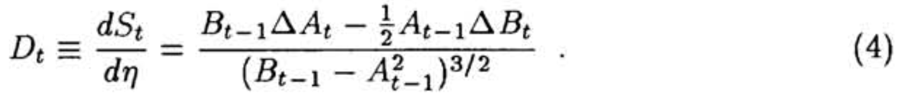

### Reinforcement Learning for Trading [[link](https://papers.nips.cc/paper/1551-reinforcement-learning-for-trading.pdf)]

Performance functions:
- Profit or Wealth
- Sharpe ratio
- differential Sharpe ratio

**Differential Sharpe ratio** - new value function for risk-adjusted return that enables learning to be done online.

Consider performance functions for systems with a single asset portfolio (price series z_t).

See _Moody et al. (1998)_ for detailed discussion of multiple asset portfolios.

Trader's **actions**:

- take long
- take neutral
- take short

\- positions F_t \in {-1, 0, 1} of constant magnitude

F_t is established at the end of time interval t and is re-assessed at the end of period t+1.

Return R\_t is realized at the end of the time interval (t-1, t] - it's profit or loss resulting from the position F_{t-1}.

**Additive Profit:**

\- where `r_t = z\_t - z_{t-1}`.

Wealth `W_T = W_0 + P_T`.

**Multiplicative profit** are appropriate when a fixed fraction of accumulated wealth \nu > 0 is invested in each long or short trade. The **Wealth** at time T:

\- where `r_t = (z\_t/z_{t-1} - 1)`.

~~Maximizing profits~~ Maximizing risk-adjusted return (according to Modern Portfolio Theory).

The measure is Sharpe ratio:

Differential Sharpe ratio for online optimization of trading system performance:

